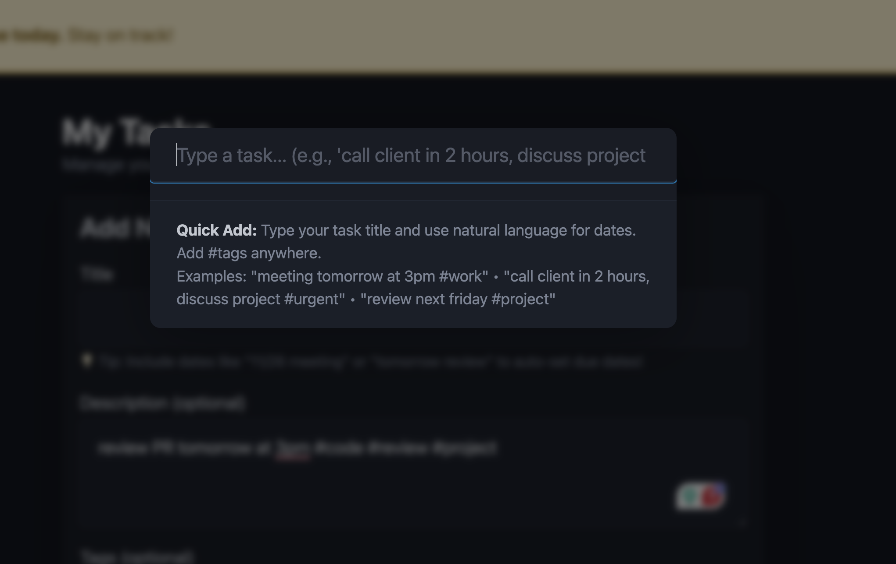

# AT Todo Features Guide

Comprehensive guide to all AT Todo features and how to use them effectively.

## Table of Contents

- [Quick Task Creation](#quick-task-creation)
- [Natural Language Date Parsing](#natural-language-date-parsing)
- [Hashtag Support](#hashtag-support)
- [Due Dates & Times](#due-dates--times)
- [Task Organization](#task-organization)
- [User Interface Preferences](#user-interface-preferences)
- [Notifications](#notifications)
- [Lists](#lists)
- [Calendar Events](#calendar-events)
- [Progressive Web App](#progressive-web-app)

---

## Quick Task Creation

### Command Bar (Cmd+Shift+P)

The fastest way to create tasks is using the Command Bar.

**Opening the Command Bar:**
- **Mac**: Press `Cmd + Shift + P`
- **Windows/Linux**: Press `Ctrl + Shift + P`



**Using the Command Bar:**

```
meeting tomorrow at 3pm, discuss project timeline #work
```

This single line creates a task with:
- **Title**: "meeting"
- **Due date**: Tomorrow at 3:00 PM
- **Description**: "discuss project timeline"
- **Tags**: ["work"]

**Syntax:**
```
[title] [date/time], [description] #tag1 #tag2
```

- Everything before the first comma becomes the title (with date extracted)
- Everything after the comma becomes the description
- Hashtags anywhere become tags
- Date/time expressions are automatically parsed and removed from title

**Examples:**
```
call client in 2 hours, discuss pricing #urgent #sales
review document next friday #work
buy groceries today #personal #shopping
```

---

## Natural Language Date Parsing

AT Todo understands natural language for dates and times. Just type naturally!

### Time-Based Relative Dates

Create tasks due at specific times from now:

| Input | Result |
|-------|--------|
| `in 2 hours` | 2 hours from current time |
| `in 30 minutes` | 30 minutes from now |
| `in one hour` | 1 hour from now |
| `in fifteen minutes` | 15 minutes from now |

**Examples:**
- `call back in 30 minutes`
- `meeting in two hours`
- `reminder 90 minutes from now`

### Day-Based Relative Dates

| Input | Result |
|-------|--------|
| `today` | Today at midnight |
| `tomorrow` | Tomorrow at midnight |
| `in 3 days` | 3 days from now |
| `next week` | 7 days from now |

### Specific Days

| Input | Result |
|-------|--------|
| `monday` | Next Monday |
| `next tuesday` | Tuesday of next week |
| `this friday` | This coming Friday |

### With Specific Times

Combine dates with times for precise scheduling:

| Input | Result |
|-------|--------|
| `tomorrow at 3pm` | Tomorrow at 3:00 PM |
| `monday at 9:30am` | Next Monday at 9:30 AM |
| `11/26 3:30pm` | November 26 at 3:30 PM |
| `next friday at 2pm` | Next Friday at 2:00 PM |

### Advanced Patterns

| Input | Result |
|-------|--------|
| `end of month` | Last day of current month |
| `end of week` | This coming Sunday |
| `next month` | Same date next month |
| `next quarter` | Start of next quarter |

### Timezone Support

All times are automatically converted to your local timezone:
- Displayed in your local time
- Stored in UTC in AT Protocol
- Notifications respect your timezone

---

## Hashtag Support

Add tags to tasks using hashtags - they're automatically extracted and removed from the text.

### Using Hashtags

**In the Command Bar:**
```
meeting tomorrow #work #urgent
```
Results in:
- Title: "meeting tomorrow"
- Tags: ["work", "urgent"]

**In Task Forms:**
Tags can also be added via the "Tags" field:
```
work, urgent, personal
```

### Tag Features

- **Max 10 tags per task**
- **Max 30 characters per tag**
- **Emoji supported**: `#🎯 #📧 #🚀`
- **Case insensitive**: `#Work` and `#work` are treated as the same
- **Auto-completion**: Suggests existing tags as you type
- **Clickable**: Click any tag to filter tasks by that tag

### Popular Tags

View your most-used tags in the dashboard sidebar to quickly filter tasks.

---

## Due Dates & Times

### Setting Due Dates

**Three ways to add due dates:**

1. **Natural language** (in title when creating):
   ```
   call client tomorrow at 3pm
   ```

2. **Command Bar**:
   ```
   review document next friday, needs approval #work
   ```

3. **Date picker** (when editing):
   - Use the date input for calendar selection
   - Use the time input for specific times
   - Leave blank for all-day tasks

### Editing Due Dates

When editing a task:
1. Click "Edit" on any task
2. Set date using the date picker
3. Optionally add a time
4. Or type in the title: `tomorrow at 3pm`

**The date/time inputs automatically show your local timezone values.**

### Visual Indicators

Tasks show visual indicators based on due dates:

- 🔴 **Overdue**: Tasks past their due date (red styling)
- 🟡 **Due Today**: Tasks due within 24 hours (yellow styling)
- 🔵 **Due Soon**: Tasks due within 3 days (blue styling)

### Due Date Display

Due dates are shown in friendly formats:
- "Today at 3:00pm"
- "Tomorrow at 9:30am"
- "Monday at 2:00pm"
- "Jan 15 at 4:00pm"
- "Yesterday" (for overdue)

---

## Task Organization

### Tags

Tags help categorize tasks:
- Add tags when creating: `#work #urgent`
- Add via tags field: `work, urgent, personal`
- Click tags to filter
- View popular tags in sidebar

### Lists

Organize related tasks into lists:

**Creating Lists:**
1. Navigate to Lists section
2. Click "Create New List"
3. Give it a name and optional description

**Adding Tasks to Lists:**
1. Click "Add to List" on any task
2. Select one or more lists
3. Tasks can belong to multiple lists

**List Features:**
- **Share lists**: Get a shareable link for any list
- **List views**: See all tasks in a list
- **Task counts**: See incomplete/complete counts per list

### Filtering

**Filter tasks by:**
- **Status**: Incomplete / Complete
- **Tags**: Click any tag to filter
- **Lists**: View tasks in specific lists
- **Due dates**: View overdue, today, or upcoming

---

## User Interface Preferences

AT Todo allows you to customize your interface preferences, which sync across all your devices via AT Protocol.

### Task Input Form Collapse

Minimize screen clutter by collapsing the task input form when you don't need it.

**How to use:**

1. Look for the **−** (minus) button in the top-right corner of the "Add New Task" section
2. Click the button to collapse the form
   - The button changes to **+** (plus) when collapsed
   - The entire task input form is hidden
3. Click again to expand the form when you need to add tasks

**Benefits:**
- **More screen space** for viewing your task list
- **Reduced visual clutter** when you're focused on completing tasks
- **Synced across devices** - your preference is saved to AT Protocol
- **Instant toggle** - collapse/expand with a single click

**Cross-Device Sync:**

Your collapse preference is stored in your AT Protocol settings, so it automatically syncs to all your devices:
- Collapse on your desktop → preference applies on your phone
- Expand on your tablet → preference applies everywhere
- Each device loads your saved preference when you visit the dashboard

**Note:** You can still use the Command Bar (`Cmd+Shift+P` or `Ctrl+Shift+P`) to quickly add tasks even when the form is collapsed!

---

## Notifications

AT Todo includes a comprehensive notification system to help you stay on top of tasks.

### In-App Notifications

**Notification Banner:**
- Appears at the top of the dashboard
- Shows counts of overdue, due today, and upcoming tasks
- Updates automatically
- Can be dismissed

**When you'll see it:**
- When you have overdue tasks (highest priority)
- When you have tasks due today
- When you have tasks due within 3 days

### Push Notifications

Get notified even when AT Todo isn't open.

**Enabling Push Notifications:**

1. **Open Settings**:
   - Click the "Settings" link in the top navigation bar
   - A settings dialog (modal) will open

2. **Find Notification Settings**:
   - In the Settings dialog, scroll to "Notification Settings"
   - You'll see your current notification status

3. **Enable Notifications**:
   - Click "Enable Push Notifications" button
   - Your browser will ask for permission - click "Allow"
   - The page will automatically subscribe this device

4. **Configure Your Preferences**:
   - Once enabled, notification preferences will appear
   - Customize timing, frequency, and quiet hours
   - Click "Save Preferences"

**Notification Settings:**

**Timing Preferences:**
- ✅ Notify about overdue tasks
- ✅ Notify about tasks due today
- ⬜ Notify about tasks due within 3 days
- Set hours before due date (0-72 hours)

**Check Frequency:**
- Every 15 minutes
- Every 30 minutes (default)
- Every hour
- Every 2 hours

**Quiet Hours / Do Not Disturb:**
- Enable quiet hours mode
- Set start time (default: 10 PM)
- Set end time (default: 8 AM)
- No notifications during quiet hours

### Notification Grouping

AT Todo intelligently groups notifications to avoid spam:

**Single Task:**
```
Task Due Soon
"Call client" is due in 2 hours.
```

**Multiple Tasks:**
```
3 Tasks Due Today
• Call client (2h)
• Team meeting (4h)
• Review document (6h)
```

**Many Tasks:**
```
5 Overdue Tasks
• Submit report
• Follow up with vendor
• Update spreadsheet
...and 2 more
```

**Priority Order:**
1. Overdue tasks (shown first, require interaction)
2. Tasks due today (shown with times)
3. Tasks due soon (within 3 days)

**Only one notification shown at a time** to avoid overwhelming you.

### Smart Scheduling (Advanced)

AT Todo learns when you typically use the app and can optimize notification timing:

- **Usage tracking**: Records what hours you're most active
- **Optimal timing**: Sends notifications during your active hours
- **Privacy-first**: All tracking stored in your AT Protocol repository
- **Automatic**: No configuration needed

### Multi-Device Notifications

AT Todo supports receiving notifications on multiple devices (phone, tablet, desktop, etc.).

**Registering Multiple Devices:**

Each device needs to be registered separately to receive notifications:

1. **On Each Device**:
   - Open AT Todo in your browser
   - Click the "Settings" link in the top navigation
   - Scroll to "Notification Settings" in the settings dialog
   - Click "Enable Push Notifications" (or "Register This Device" if already enabled)
   - Grant browser permission when prompted

2. **Verify Registration**:
   - In Settings, look for "Registered Devices" section
   - You should see a list of all your registered devices
   - Each device shows its browser/OS and registration date
   - Example: "Device 1: Mozilla/5.0 (Macintosh; Intel Mac OS...) (added 11/22/2024)"

3. **Managing Devices**:
   - Click the X button next to any device to remove it from notifications
   - Devices can be re-registered at any time by clicking "Register This Device"
   - Remove old/unused devices to keep your device list clean
   - Inactive subscriptions expire automatically over time

**How It Works:**
- Each browser/device gets a unique push subscription
- Notifications are sent to **all registered devices simultaneously**
- You'll receive notifications on your phone, tablet, and desktop
- Completing a task on one device doesn't clear notifications on others

### Test Notifications

**Test your notification setup:**
1. Open Settings
2. Enable notifications if not already enabled
3. Click "Send Test Notification"
4. You should see a test notification on **all registered devices**
5. Check the response message to see how many devices received it

**If notifications aren't working:**
- Check browser notification permissions
- Ensure notifications aren't blocked in system settings
- Try a different browser (Chrome/Edge have best support)
- Check quiet hours settings
- Click "Register This Device" to refresh registration
- Verify device appears in "Registered Devices" list

### Browser Compatibility

| Feature | Chrome | Firefox | Safari | Edge |
|---------|--------|---------|--------|------|
| Push Notifications | ✅ | ✅ | ✅ (iOS 16.4+) | ✅ |
| Background Sync | ✅ | ❌ | ❌ | ✅ |
| Periodic Sync | ✅ | ❌ | ❌ | ✅ |

**Note**: Safari and Firefox users will get notifications when the app is open or during periodic checks, but won't get background notifications.

---

## Lists

### Creating and Managing Lists

**Create a List:**
1. Navigate to the Lists tab
2. Click "Create New List"
3. Enter name and optional description
4. Click "Create List"

**Edit a List:**
1. Find the list in your Lists view
2. Click "Edit"
3. Update name or description
4. Click "Save"

**Delete a List:**
1. Click "Delete" on any list
2. Confirm deletion
3. Tasks remain - only list membership is removed

### Adding Tasks to Lists

**From a Task:**
1. Click "Add to List" on any task
2. Select one or more lists
3. Task is added to selected lists

**Tasks can belong to multiple lists** - useful for organization:
- Add "Submit report" to both "Work" and "High Priority" lists
- Add "Buy groceries" to "Personal" and "Weekly Routine" lists

### Viewing Lists

**List Overview:**
- See all your lists with task counts
- Shows incomplete and completed task counts
- Click list name to view all tasks in that list

**List Detail View:**
- See all tasks in the list
- Tasks show their full details
- Filter and sort tasks within the list
- Tasks indicate membership in other lists

### Sharing Lists

**Create a shareable link:**
1. Open any list
2. Click "Share List"
3. Copy the link
4. Share with anyone

**Shared lists are public** - anyone with the link can view tasks in that list (but not edit them).

---

## Calendar Events

AT Todo integrates with the AT Protocol calendar ecosystem, allowing you to view calendar events created by other calendar applications like [Smokesignal](https://smokesignal.events).

### What are Calendar Events?

Calendar events are social events stored in the AT Protocol using the `community.lexicon.calendar.event` lexicon. Unlike tasks (which are personal todo items), calendar events are typically:

- **Public or shared**: Visible to others in the AT Protocol network
- **Time-specific**: Have defined start/end times
- **Social**: Support RSVPs and attendance tracking
- **External**: Created by dedicated calendar apps like Smokesignal

### Viewing Calendar Events

**Access calendar events:**
1. Navigate to the **📅 Events** tab in your dashboard
2. Choose between two views:
   - **Upcoming Events**: Shows events in the next 7 days
   - **All Events**: Shows all calendar events

**Event display includes:**
- 📅 Event name and description
- 🕐 Start and end times (in your local timezone)
- 📍 Location information (for in-person events)
- 💻 Attendance mode (Virtual, In Person, or Hybrid)
- 🔗 Links to related resources
- 💨 Direct link to view on Smokesignal

### Event Details

**View detailed information:**
1. Click "View Details" on any event card
2. A modal opens showing:
   - Full event description
   - Complete date/time information
   - Event status (Planned, Scheduled, Rescheduled, Cancelled)
   - Location details with addresses
   - Attendance mode with visual indicators
   - Related URLs and resources
   - Your personal RSVP status (if you've RSVP'd)
   - Link to view all RSVPs on Smokesignal

**Visual indicators:**
- 💻 **Virtual**: Online-only events
- 📍 **In Person**: Physical location events
- 🔄 **Hybrid**: Both online and in-person options

### Event Sources

AT Todo displays events from two sources:

1. **Your own events**: Calendar events in your AT Protocol repository
2. **RSVP'd events**: Events you've RSVP'd to via calendar apps

All events are read-only in AT Todo. To create or manage events, use a dedicated calendar app like [Smokesignal](https://smokesignal.events).

### Calendar Notifications

Stay informed about upcoming events with automatic notifications.

**Enabling calendar notifications:**
1. Open Settings
2. Scroll to "Calendar Notification Settings"
3. Toggle "Enable calendar event notifications"
4. Set your preferred lead time (default: 1 hour before event)
5. Ensure push notifications are enabled

**Notification timing:**
- Choose how far in advance to be notified (e.g., "1h", "30m", "2h")
- Notifications sent when events fall within your lead time window
- Default: 1 hour before event start time
- Respects quiet hours settings

**What you'll receive:**
```
Upcoming Event: Community Meetup
💻 Virtual event starts in 1 hour
```

**Smart notification features:**
- ✅ Shows event mode (Virtual/In-Person/Hybrid)
- ✅ Calculates time until event starts
- ✅ Links to Smokesignal for full details
- ✅ Sent to all registered devices
- ✅ Won't spam (24-hour cooldown per event)

**Notification frequency:**
Calendar events are checked every 30 minutes for upcoming events (separate from task notifications which run every 5 minutes).

### RSVPs and Attendance

**Viewing your RSVP:**
- Open event details to see your RSVP status
- Status indicators:
  - ✓ **Going** (green)
  - ⓘ **Interested** (blue)
  - ✗ **Not Going** (red)

**Managing RSVPs:**
RSVPs are managed through calendar applications like Smokesignal. AT Todo displays your RSVP status but doesn't provide RSVP functionality.

**To RSVP to an event:**
1. Click the 💨 Smokesignal link in the event details
2. RSVP on Smokesignal
3. Your RSVP status will appear in AT Todo automatically

### Event Status Badges

Events display status badges to indicate their current state:

- **Scheduled** (green): Confirmed and finalized
- **Planned** (blue): Created but not yet finalized
- **Rescheduled** (orange): Date/time has been changed
- **Cancelled** (red): Event has been cancelled
- **Postponed** (red): Event delayed with no new date

Cancelled and postponed events still appear in your calendar but are clearly marked.

### Integration with Smokesignal

AT Todo integrates seamlessly with [Smokesignal](https://smokesignal.events), the premier AT Protocol calendar application.

**Smokesignal features:**
- Create and manage calendar events
- RSVP to events
- View all RSVPs and attendees
- Share event links
- Event discovery and search

**Quick access:**
- Click the 💨 emoji next to any event name
- Opens the event directly on Smokesignal
- View full attendee list
- Manage your RSVP
- Share event with others

### Google Calendar & iCal Subscription

Subscribe to your AT Protocol calendar events **and tasks** in Google Calendar, Apple Calendar, Outlook, or any calendar app that supports iCal feeds.

**Getting your iCal feed URLs:**

AT Todo provides two separate feeds:

**Calendar Events Feed:**
```
https://attodo.app/calendar/feed/{your-did}/events.ics
```

**Tasks Feed (tasks with due dates):**
```
https://attodo.app/tasks/feed/{your-did}/tasks.ics
```

To find your DID:
1. Open AT Todo and navigate to the 📅 Events tab
2. Open your browser's developer console (F12)
3. Your DID appears in the console when loading events, or
4. Check your AT Protocol profile on Bluesky

**Subscribing in Google Calendar:**

You can subscribe to both feeds separately:

**For Events:**
1. Open [Google Calendar](https://calendar.google.com)
2. Click the **+** next to "Other calendars"
3. Select **"From URL"**
4. Paste your events feed URL: `https://attodo.app/calendar/feed/{your-did}/events.ics`
5. Click **"Add calendar"**

**For Tasks:**
1. Click the **+** next to "Other calendars" again
2. Select **"From URL"**
3. Paste your tasks feed URL: `https://attodo.app/tasks/feed/{your-did}/tasks.ics`
4. Click **"Add calendar"**

Your AT Protocol events and tasks will now appear in Google Calendar and sync automatically!

**Subscribing in Apple Calendar:**

Subscribe to both feeds for complete coverage:

1. Open Calendar app
2. Go to **File** → **New Calendar Subscription**
3. Paste your events feed URL, click **Subscribe**
4. Choose auto-refresh frequency (recommended: every hour)
5. Repeat for tasks feed URL

**Subscribing in Outlook:**

Subscribe to both feeds separately:

1. Open Outlook
2. Go to **File** → **Account Settings** → **Internet Calendars**
3. Click **New**
4. Paste your events feed URL, click **Add**
5. Repeat for tasks feed URL

**What syncs from Events Feed:**
- ✅ Event names and descriptions
- ✅ Start and end times (in your timezone)
- ✅ Location information
- ✅ Event status (confirmed, tentative, cancelled)
- ✅ Links to Smokesignal
- ✅ Event mode (virtual/in-person/hybrid) as categories

**What syncs from Tasks Feed:**
- ✅ Task titles and descriptions
- ✅ Due dates (in your timezone)
- ✅ Completion status
- ✅ Tags as categories
- ✅ Only tasks with due dates (no due date = not included)

**Auto-refresh:**
- Calendar apps check for updates periodically
- Google Calendar: Every few hours
- Apple Calendar: Configurable (hourly recommended)
- Outlook: Configurable

**Privacy note:**
Calendar events and tasks in AT Protocol are public by design. Anyone with your iCal feed URLs can view your events and tasks. This is the same as viewing them on Smokesignal or other AT Protocol apps.

**Tips:**
- Subscribe to both feeds to see your complete schedule in one place
- Tasks appear as "todos" in most calendar apps
- Completed tasks remain in the feed with completion status
- Use separate calendar colors to distinguish events from tasks

### Event Timezone Handling

All event times are automatically converted to your local timezone:
- **Displayed**: In your browser's timezone
- **Stored**: In UTC in AT Protocol
- **Notifications**: Respect your local time
- **Created date**: Shows when the event was created (in local time)

### Read-Only Access

**Important notes:**
- 📖 Calendar events in AT Todo are **read-only**
- ✏️ To create or edit events, use a calendar app like Smokesignal
- 🔄 AT Todo automatically syncs events from your AT Protocol repository
- 📅 Perfect for viewing your event schedule alongside your tasks

### Calendar Best Practices

**Organizing your calendar:**
1. **Use Smokesignal** for event creation and management
2. **View in AT Todo** to see events alongside tasks
3. **Enable notifications** to stay informed
4. **RSVP on Smokesignal** to indicate attendance
5. **Share event links** from Smokesignal with others

**Integrating with tasks:**
- Create tasks for event preparation (e.g., "Prepare presentation for Monday meetup")
- Use tags to link tasks to events (e.g., #meetup, #conference)
- Set task due dates relative to event times
- Enable both task and calendar notifications

---

## Progressive Web App

AT Todo is a Progressive Web App (PWA) that can be installed on your device.

### Installing AT Todo

**Desktop (Chrome/Edge):**
1. Visit AT Todo
2. Click the install icon in the address bar
3. Click "Install"

**iOS (Safari):**
1. Open AT Todo in Safari
2. Tap the Share button
3. Tap "Add to Home Screen"
4. Tap "Add"

**Android (Chrome):**
1. Open AT Todo in Chrome
2. Tap the menu (three dots)
3. Tap "Add to Home Screen"
4. Tap "Add"

### PWA Benefits

**Once installed:**
- 🚀 **Faster loading** - cached resources
- 📱 **Standalone app** - opens like a native app
- 🔔 **Better notifications** - system-level push notifications
- 📴 **Offline access** - view cached tasks without internet
- 💾 **Smaller footprint** - no app store download needed

### Offline Support

**What works offline:**
- View previously loaded tasks
- View cached lists
- See task details
- Navigate between views

**What requires internet:**
- Creating new tasks
- Editing tasks
- Deleting tasks
- Syncing with AT Protocol
- Push notifications

**Auto-sync when online** - changes sync automatically when connection is restored.

---

## Privacy & Data Ownership

### Your Data, Your Control

- **Decentralized storage**: Tasks stored in YOUR AT Protocol repository
- **No central database**: AT Todo servers don't store your tasks
- **Portable**: Your data works with any AT Protocol app

### Notification Privacy

- **Client-side logic**: All notification checking runs in your browser
- **No tracking**: No server-side tracking of notification views
- **Your settings**: Preferences stored in your AT Protocol repository
- **Local caching**: Settings cached locally for performance

### What's Stored Where

**In your AT Protocol repository:**
- Tasks (title, description, due dates, tags, status)
- Lists (name, description, task references)
- Notification settings (preferences, quiet hours)
- Usage patterns (for smart scheduling)

**On your device:**
- Session tokens (temporary)
- Cached tasks (for offline access)
- Service worker cache (for PWA functionality)

**Never stored:**
- Your password
- Browsing history

**Stored server-side**
- Subscription status
- Email address (for contacting you only)

---

## Tips & Tricks

### Power User Tips

1. **Keyboard shortcuts**: `Cmd/Ctrl + Shift + P` for quick task creation
2. **Copy natural language**: Copy from calendar invites, paste into command bar
3. **Bulk tagging**: Add common tags to multiple related tasks
4. **Smart lists**: Create lists for contexts ("Work", "Home", "Errands")
5. **Time blocking**: Use due times to create a schedule
6. **Emoji tags**: Use `#🎯` for visual identification
7. **Morning review**: Check notification banner for today's priorities
8. **Weekly planning**: Use "due soon" filter to plan the week ahead

### Productivity Workflows

**Daily Review:**
1. Check notification banner for overdue/today tasks
2. Use command bar to quickly add new tasks
3. Mark completed tasks as done
4. Review "due soon" for tomorrow's priorities

**Weekly Planning:**
1. Review all incomplete tasks
2. Set due dates for the week
3. Use lists to organize by area (Work, Personal, etc.)
4. Enable "due soon" notifications for 3-day visibility

**Project Management:**
1. Create a list for each project
2. Tag tasks with project phases (#planning, #execution, #review)
3. Use due dates for milestones
4. Share project lists with team members

---

## Troubleshooting

### Common Issues

**Tasks not syncing:**
- Check internet connection
- Try refreshing the page
- Check AT Protocol status

**Notifications not appearing:**
- Check browser notification permissions
- Verify notifications enabled in Settings
- Test with "Send Test Notification"
- Check quiet hours settings
- Try a different browser

**Date parsing not working:**
- Check format: "tomorrow at 3pm" not "tomorrow 3pm"
- Use "at" before times
- Use AM/PM or 24-hour format
- Try date picker instead

**Timezone issues:**
- All times displayed in your local timezone
- Stored in UTC in AT Protocol
- Check system timezone settings
- Edit task to verify correct time shown

### Getting Help

- Check the [Getting Started guide](/docs/getting-started)
- Review this features guide
- Report issues on GitHub
- Contact via Bluesky

---

## What's Next?

AT Todo is continuously evolving. Planned features include:

- Recurring tasks
- Task templates
- Calendar integration
- Collaboration features
- Advanced filtering
- Custom views
- Mobile app

Stay tuned for updates!
